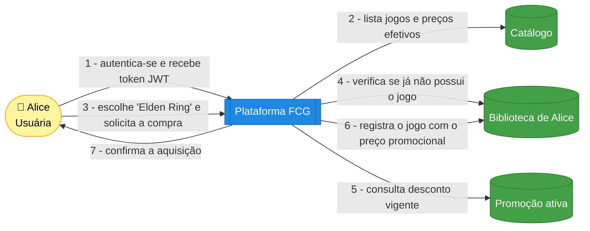

# Domain Storytelling — "Usuário adquire um jogo"

Narrativa de um cenário de interação com a plataforma, no estilo **Domain Storytelling**
(atores, objetos de trabalho e atividades numeradas na ordem em que acontecem).

## História

> **Cenário:** a jogadora *Alice* já cadastrada quer adquirir o jogo *Elden Ring*, que está em promoção.

## Passo a passo

1. **Alice se autentica** (`POST /api/v1/auth/login`) e recebe um **token JWT**.
2. A plataforma apresenta o **catálogo** com o **preço efetivo** de cada jogo (consulta Dapper que já aplica a promoção vigente).
3. Alice **solicita a compra** de *Elden Ring* (`POST /api/v1/library/{gameId}`).
4. A plataforma verifica que Alice **ainda não possui** o jogo (invariante do agregado `User`).
5. Consulta se há **promoção ativa** para o jogo no momento.
6. **Registra o jogo na biblioteca** de Alice com o **preço já descontado** (evento `GameAcquired`).
7. Retorna a **confirmação** da aquisição, com o valor pago e o desconto aplicado.

## Regras evidenciadas

- Aquisição exige **usuário autenticado**.
- **Não é possível adquirir o mesmo jogo duas vezes** → retorna `409 Conflict`.
- O **preço pago** reflete a promoção ativa no instante da compra.
