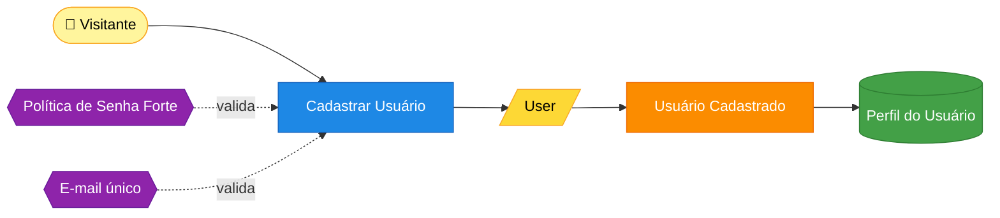
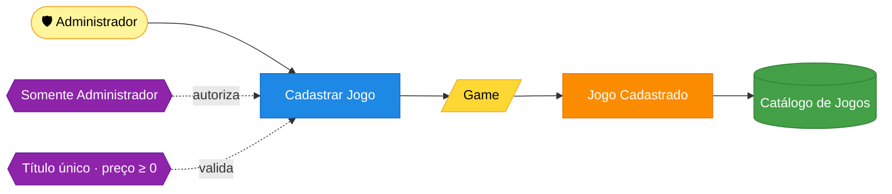
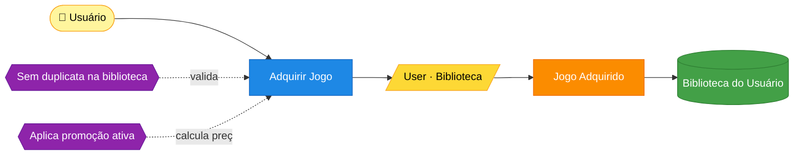

# Event Storming — FIAP Cloud Games (Fase 1)

Mapeamento dos fluxos de negócio no estilo **Event Storming**. Os diagramas abaixo estão em Mermaid
(renderizam no GitHub) e podem ser reproduzidos no Miro usando a mesma legenda de cores.

## 🎨 Legenda

| Cor | Elemento | Significado |
|---|---|---|
| 🟦 Azul | **Comando** | Intenção/ação disparada por um ator |
| 🟧 Laranja | **Evento de Domínio** | Fato relevante que ocorreu (no passado) |
| 🟨 Amarelo | **Agregado** | Consistência transacional; recebe o comando e emite o evento |
| 🟪 Lilás | **Política / Regra** | Reação automática ou invariante ("sempre que…") |
| 🟩 Verde | **Read Model** | Visão de leitura consumida pela UI/consulta |
| 🟡 Creme | **Ator** | Pessoa/papel que dispara o comando |

---

## 1. Criação de usuários

> Um visitante se cadastra na plataforma. A senha precisa respeitar a política de segurança e o e-mail deve ser único.

**Regras (invariantes):**
- E-mail com formato válido e **único** na base.
- Senha com **mínimo de 8 caracteres**, contendo letras, números e caracteres especiais (Value Object `Password`).
- A senha nunca é persistida em texto puro — apenas o **hash BCrypt**.
- Todo usuário é criado com o papel **Usuário** e ativo.

**Rastreabilidade no código:** `POST /api/v1/auth/register` → `UserCommandService.RegisterAsync` → `new User(...)` → evento `UserRegistered`.

---

## 2. Criação de jogos

> Um administrador cadastra um jogo no catálogo.

**Regras (invariantes):**
- Apenas o papel **Administrador** pode cadastrar jogos (autorização JWT).
- Título e gênero são obrigatórios; **título único**; preço não-negativo (`Money`).

**Rastreabilidade no código:** `POST /api/v1/games` (policy `Admin`) → `GameCommandService.CreateAsync` → `new Game(...)` → evento `GameCreated`.

---

## 3. Aquisição de um jogo (bônus)

> Um usuário adquire um jogo; se houver promoção ativa, o desconto é aplicado ao preço pago.

**Regras (invariantes):**
- O usuário **não pode possuir o mesmo jogo duas vezes** (invariante do agregado `User`).
- Se houver promoção ativa para o jogo no momento, o **preço pago recebe o desconto**.

**Rastreabilidade no código:** `POST /api/v1/library/{gameId}` → `LibraryService.AcquireAsync` → `User.AcquireGame(...)` → evento `GameAcquired`.
